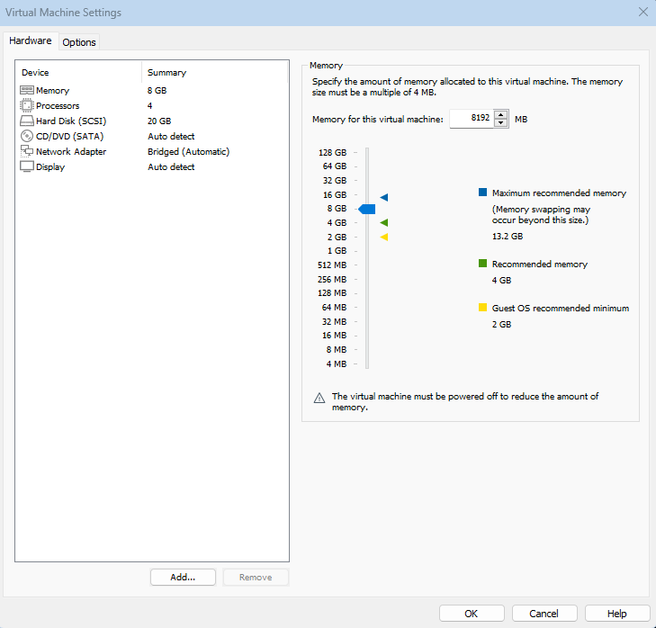

# Домашнее задание 08
## Нагрузочное тестирование и тюнинг PostgreSQL

### Цель:
* Сделать нагрузочное тестирование PostgreSQL
* Настроить параметры PostgreSQL для достижения максимальной производительности

**Описание/Пошаговая инструкция выполнения домашнего задания:**
1. Развернуть виртуальную машину любым удобным способом 
2. Поставить на неё **PostgreSQL 15** любым способом 
3. Настроить кластер **PostgreSQL 15** на максимальную производительность не обращая внимание на возможные проблемы с надежностью в случае аварийной перезагрузки виртуальной машины
4. Нагрузить кластер через утилиту через утилиту [_**pgbench**_](https://postgrespro.ru/docs/postgrespro/14/pgbench)
5. Написать какого значения **tps** удалось достичь, показать какие параметры в какие значения устанавливали и почему
#### Задание со *: 
* Аналогично протестировать через [утилиту](https://github.com/Percona-Lab/sysbench-tpcc) ([требует установки](https://github.com/akopytov/sysbench))
---

#### Развернём виртуальную машину:


#### Поставим на неё **PostgreSQL 15**:
```shell
ubuntu@db-configure:~#  sudo sh -c 'echo "deb http://apt.postgresql.org/pub/repos/apt $(lsb_release -cs)-pgdg main" > /etc/apt/sources.list.d/pgdg.list'
ubuntu@db-configure:~# wget -qO- https://www.postgresql.org/media/keys/ACCC4CF8.asc | sudo tee /etc/apt/trusted.gpg.d/pgdg.asc &>/dev/null
ubuntu@db-configure:~# sudo apt update -y
Сущ:1 http://ru.archive.ubuntu.com/ubuntu noble InRelease
Сущ:2 http://ru.archive.ubuntu.com/ubuntu noble-updates InRelease
Сущ:3 http://ru.archive.ubuntu.com/ubuntu noble-backports InRelease
Сущ:4 https://download.docker.com/linux/ubuntu noble InRelease
Пол:5 http://apt.postgresql.org/pub/repos/apt noble-pgdg InRelease [129 kB]
Пол:6 http://apt.postgresql.org/pub/repos/apt noble-pgdg/main amd64 Packages [306 kB]
Сущ:7 http://security.ubuntu.com/ubuntu noble-security InRelease
Получено 435 kB за 3с (156 kB/s)
Чтение списков пакетов… Готово
Построение дерева зависимостей… Готово
Чтение информации о состоянии… Готово
Может быть обновлено 10 пакетов. Запустите «apt list --upgradable» для их показа.
W: https://download.docker.com/linux/ubuntu/dists/noble/InRelease: Key is stored in legacy trusted.gpg keyring (/etc/apt/trusted.gpg), see the DEPRECATION section in apt-key(8) for details.
root@db-configure:~# sudo apt install -y postgresql-15
Чтение списков пакетов… Готово
Построение дерева зависимостей… Готово
Чтение информации о состоянии… Готово
Следующие пакеты устанавливались автоматически и больше не требуются:
  libcares2 libevent-2.1-7t64 python3-cdiff python3-dateutil python3-dnspython python3-etcd python3-prettytable python3-psutil python3-psycopg2 python3-wcwidth
Для их удаления используйте «sudo apt autoremove».
Будут установлены следующие дополнительные пакеты:
  postgresql-client-15
Предлагаемые пакеты:
  postgresql-doc-15
Следующие НОВЫЕ пакеты будут установлены:
  postgresql-15 postgresql-client-15
...
````
Проверим:
```shell
postgres@db-configure:~$ pg_lsclusters
Ver Cluster Port Status Owner    Data directory              Log file
15  main    5432 online postgres /var/lib/postgresql/15/main log/postgresql-%Y-%m-%d_%H%M%S.log
```
Заполним БД: 
```shell
postgres=# CREATE DATABASE shop;
CREATE DATABASE
postgres=# \c shop
psql (16.4 (Ubuntu 16.4-0ubuntu0.24.04.2), server 15.8 (Ubuntu 15.8-1.pgdg24.04+1))
You are now connected to database "shop" as user "postgres".
shop=# CREATE TABLE Products
(
    Id SERIAL PRIMARY KEY,
    ProductName VARCHAR(30) NOT NULL,
    Manufacturer VARCHAR(20) NOT NULL,
    ProductCount INTEGER DEFAULT 0,
    Price NUMERIC
);
CREATE TABLE
shop=#  \d Products
                                      Table "public.products"
    Column    |         Type          | Collation | Nullable |               Default
--------------+-----------------------+-----------+----------+--------------------------------------
 id           | integer               |           | not null | nextval('products_id_seq'::regclass)
 productname  | character varying(30) |           | not null |
 manufacturer | character varying(20) |           | not null |
 productcount | integer               |           |          | 0
 price        | numeric               |           |          |
Indexes:
    "products_pkey" PRIMARY KEY, btree (id)

shop=# INSERT INTO Products  (ProductName, Manufacturer, ProductCount, Price)
VALUES
('iPhone 6', 'Apple', 3, 36000),
('Galaxy S8', 'Samsung', 2, 46000),
('Galaxy S8 Plus', 'Samsung', 1, 56000),
('Desire 12', 'HTC', 8, 21000),
('iPhone X', 'Apple', 9, 93000);
INSERT 0 5
```
Прогоним тест на default-настройках БД:
```shell
postgres@db-configure:~$ pgbench -i shop
dropping old tables...
creating tables...
generating data (client-side)...
100000 of 100000 tuples (100%) done (elapsed 0.04 s, remaining 0.00 s)
vacuuming...
creating primary keys...
done in 0.23 s (drop tables 0.01 s, create tables 0.00 s, client-side generate 0.05 s, vacuum 0.05 s, primary keys 0.11 s).
postgres@db-configure:~$ pgbench -c 50 -j 4 -P 10 -T 60 shop
pgbench (15.8 (Ubuntu 15.8-1.pgdg24.04+1))
starting vacuum...end.
progress: 10.0 s, 1059.4 tps, lat 46.260 ms stddev 61.236, 0 failed
progress: 20.0 s, 1118.6 tps, lat 44.537 ms stddev 64.529, 0 failed
progress: 30.0 s, 1057.1 tps, lat 47.068 ms stddev 61.853, 0 failed
progress: 40.0 s, 995.4 tps, lat 50.230 ms stddev 73.222, 0 failed
progress: 50.0 s, 1009.8 tps, lat 49.806 ms stddev 66.232, 0 failed
progress: 60.0 s, 1099.8 tps, lat 45.283 ms stddev 53.447, 0 failed
transaction type: <builtin: TPC-B (sort of)>
scaling factor: 1
query mode: simple
number of clients: 50
number of threads: 1
maximum number of tries: 1
duration: 60 s
number of transactions actually processed: 63450
number of failed transactions: 0 (0.000%)
latency average = 47.178 ms
latency stddev = 63.687 ms
initial connection time = 166.952 ms
tps = 1058.588847 (without initial connection time)
```
#### Настроим кластер **PostgreSQL 15** на максимальную производительность (не обращая внимание на проблемы с надежностью в случае аварийной перезагрузки ВМ):
Проверим что скажет [PGTune](https://pgtune.godream.su/):
```shell
root@db-configure:/etc/postgresql/15/main/conf.d# cat ./pgtune.conf
max_connections = 50
shared_buffers = 2GB
effective_cache_size = 6GB
maintenance_work_mem = 512MB
checkpoint_completion_target = 0.9
wal_buffers = 16MB
default_statistics_target = 100
random_page_cost = 1.1
effective_io_concurrency = 200
work_mem = 19784kB
huge_pages = off
min_wal_size = 1GB
max_wal_size = 4GB
max_worker_processes = 4
max_parallel_workers_per_gather = 2
max_parallel_workers = 4
max_parallel_maintenance_workers = 2
checkpoint_timeout = 60min
autovacuum = off
wal_level = minimal
max_wal_senders = 0
synchronous_commit = off
fsync = off
full_page_writes = off
```
#### Нагрузим кластер через утилиту через утилиту [_**pgbench**_](https://postgrespro.ru/docs/postgrespro/14/pgbench)
```shell
postgres@db-configure:~$ pgbench -c 50 -j 4 -P 10 -T 60 shop
pgbench (15.8 (Ubuntu 15.8-1.pgdg24.04+1))
starting vacuum...end.
progress: 10.0 s, 1452.2 tps, lat 34.067 ms stddev 46.605, 0 failed
progress: 20.0 s, 1859.9 tps, lat 26.917 ms stddev 35.301, 0 failed
progress: 30.0 s, 1947.7 tps, lat 25.680 ms stddev 33.782, 0 failed
progress: 40.0 s, 1830.7 tps, lat 27.233 ms stddev 36.136, 0 failed
progress: 50.0 s, 1617.9 tps, lat 30.923 ms stddev 41.879, 0 failed
progress: 60.0 s, 1633.8 tps, lat 30.585 ms stddev 41.103, 0 failed
transaction type: <builtin: TPC-B (sort of)>
scaling factor: 1
query mode: simple
number of clients: 50
number of threads: 4
maximum number of tries: 1
duration: 60 s
number of transactions actually processed: 103472
number of failed transactions: 0 (0.000%)
latency average = 28.985 ms
latency stddev = 39.097 ms
initial connection time = 59.032 ms
tps = 1723.774011 (without initial connection time)

```
#### Написать какого значения tps удалось достичь, показать какие параметры в какие значения устанавливали и почему?

>> Значения tps получились не так велики. Было tps=1058, а стало tps=1723
>> Сделал меньше что-бы информация в wal реже попадала на диск и включил асинхронный режим. Для этого использовал настройки full_page_writes, fsync, synchronous_commit, max_wal_senders, wal_level, max_wal_size, min_wal_size, wal_buffers, checkpoint_timeout.
Отключил autovacuum, чтобы воркеры не отбирали ресурсов. Так-как ssd диск, то использовались рекомендуемые настройки effective_io_concurrency и default_statistics_target. 