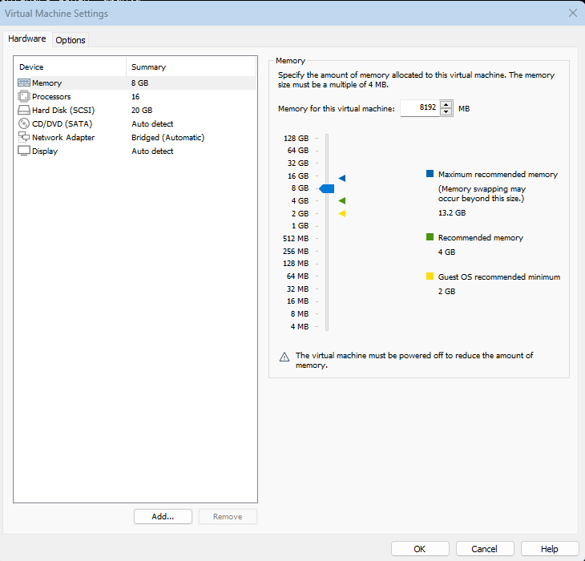

# Домашнее задание 09
## Бэкапы

### Цель:
* применить логический бэкап. Восстановиться из бэкапа.

### Описание/Пошаговая инструкция выполнения домашнего задания:
1. Создаем ВМ/докер c ПГ.
2. Создаем БД, схему и в ней таблицу.
3. Заполним таблицы автосгенерированными 100 записями.
4. Под линукс пользователем Postgres создадим каталог для бэкапов
5. Сделаем логический бэкап используя утилиту COPY
6. Восстановим в 2 таблицу данные из бэкапа.
7. Используя утилиту pg_dump создадим бэкап в кастомном сжатом формате двух таблиц
8. Используя утилиту pg_restore восстановим в новую БД только вторую таблицу!

ДЗ сдается в виде миниотчета на гитхабе с описанием шагов и с какими проблемами столкнулись.

------
#### Создаем ВМ c ПГ


#### Создаем БД и схему.
```postgresql
ubuntu@db-configure:~$ sudo -i -u postgres psql
[sudo] password for ubuntu:
psql (17.0 (Ubuntu 17.0-1.pgdg24.04+1), сервер 15.8 (Ubuntu 15.8-1.pgdg24.04+1))
Введите "help", чтобы получить справку.

postgres=# create database otus;
CREATE DATABASE
postgres=# \c otus
psql (17.0 (Ubuntu 17.0-1.pgdg24.04+1), сервер 15.8 (Ubuntu 15.8-1.pgdg24.04+1))
Вы подключены к базе данных "otus" как пользователь "postgres".

otus=# create schema backup;
CREATE SCHEMA
    
```
#### Создадим таблицу и заполним таблицы автосгенерированными 100 записями.
```postgresql
otus=# create table backup.students as select generate_series(1, 100) as id, md5(random()::text)::char(100) as fio;

otus=# select * from backup.students limit 10;
 id |                                                 fio
----+------------------------------------------------------------------------------------------------------
  1 | f8307e8938eacba0cd0899feacb5beb9
  2 | c12fbbe3c4711b027486bb00271cc315
  3 | e9921778806ae747e590353b57013211
  4 | 89afa83da9272cf68bb7bb99f3b8e6cd
  5 | d252fdec4059b07174acd13d2203563d
  6 | 2c988435361abe7e56f90e9e1cdb932c
  7 | 61a3de8a34defb4a98c0a6c3061a548d
  8 | 68fffad2c24d9dca3cc30e1c3acfef2c
  9 | 27f5efaf12fc055ed5a8e5e84ffac46f
 10 | 69db01f5ac19ee531322bd4895a2376b
(10 строк)
```
#### Под линукс пользователем Postgres создадим каталог для бэкапов
```shell
root@db-configure:~# mkdir /home/backup
root@db-configure:~# chown -R postgres: /home/backup
root@db-configure:~# sudo -i -u postgres bash
postgres@db-configure:~$ cd /home/backup/
postgres@db-configure:/home/backup$ ls -la
total 8
drwxr-xr-x 2 postgres postgres 4096 окт 25 20:52 .
drwxr-xr-x 7 root     root     4096 окт 25 20:52 ..
```
#### Сделаем логический бэкап используя утилиту COPY
```postgresql
otus=# copy backup.students to '/home/backup/students';
COPY 100
```
Проверим:
```shell
postgres@db-configure:/home/backup$ ls -la
total 20
drwxr-xr-x 2 postgres postgres  4096 окт 25 21:00 .
drwxr-xr-x 7 root     root      4096 окт 25 20:52 ..
-rw-r--r-- 1 postgres postgres 10392 окт 25 21:00 students
postgres@db-configure:/home/backup$ cat ./students
1       f8307e8938eacba0cd0899feacb5beb9
2       c12fbbe3c4711b027486bb00271cc315
3       e9921778806ae747e590353b57013211
4       89afa83da9272cf68bb7bb99f3b8e6cd
5       d252fdec4059b07174acd13d2203563d
6       2c988435361abe7e56f90e9e1cdb932c
7       61a3de8a34defb4a98c0a6c3061a548d
8       68fffad2c24d9dca3cc30e1c3acfef2c
9       27f5efaf12fc055ed5a8e5e84ffac46f
10      69db01f5ac19ee531322bd4895a2376b
11      68002e7206cacfe141a970a753336cb2
12      c32e24d7a8dc9b9fd5ce06e9d841cde5
13      9f6e520a60b63da727eea45dddd5f1c0
14      f132d412dea253d7b5da738f30848c2d
.......
```
#### Восстановим в 2 таблицу данные из бэкапа.
```postgresql
otus=# create table backup.students2 (
    id SERIAL PRIMARY KEY,
    text TEXT
);
CREATE TABLE
otus=# copy backup.students2 from '/home/backup/students';
COPY 100
```
#### Используя утилиту pg_dump создадим бэкап в кастомном  сжатом формате двух таблиц
```postgresql
postgres@db-configure:/$ pg_dump -d otus -t backup.students -t backup.students2 --create -Fc -v -f /home/backup/db_students.gz
pg_dump: последний системный OID: 16383
```
```shell
postgres@db-configure:/$ ls -la /home/backup/
total 28
drwxr-xr-x 2 postgres postgres  4096 окт 25 21:23 .
drwxr-xr-x 7 root     root      4096 окт 25 20:52 ..
-rw-rw-r-- 1 postgres postgres  7629 окт 25 21:23 db_students.gz
-rw-r--r-- 1 postgres postgres 10392 окт 25 21:00 students
```

#### Используя утилиту pg_restore восстановим в новую БД только вторую таблицу!
```shell
postgres@db-configure:/$ pg_restore -v -d restore -Fc -t students2 /home/backup/db_students.gz
pg_restore: подключение к базе данных для восстановления
pg_restore: создаётся TABLE "backup.students2"
pg_restore: обрабатываются данные таблицы "backup.students2"
```
```postgresql
postgres=# create database restore;
CREATE DATABASE
restore=# create schema backup;
CREATE SCHEMA
postgres=# \c restore
restore=# select * from backup.students2 limit 10;
  1 | f8307e8938eacba0cd0899feacb5beb9
  2 | c12fbbe3c4711b027486bb00271cc315
  3 | e9921778806ae747e590353b57013211
  4 | 89afa83da9272cf68bb7bb99f3b8e6cd
  5 | d252fdec4059b07174acd13d2203563d
  6 | 2c988435361abe7e56f90e9e1cdb932c
  7 | 61a3de8a34defb4a98c0a6c3061a548d
  8 | 68fffad2c24d9dca3cc30e1c3acfef2c
  9 | 27f5efaf12fc055ed5a8e5e84ffac46f
 10 | 69db01f5ac19ee531322bd4895a2376b
```
