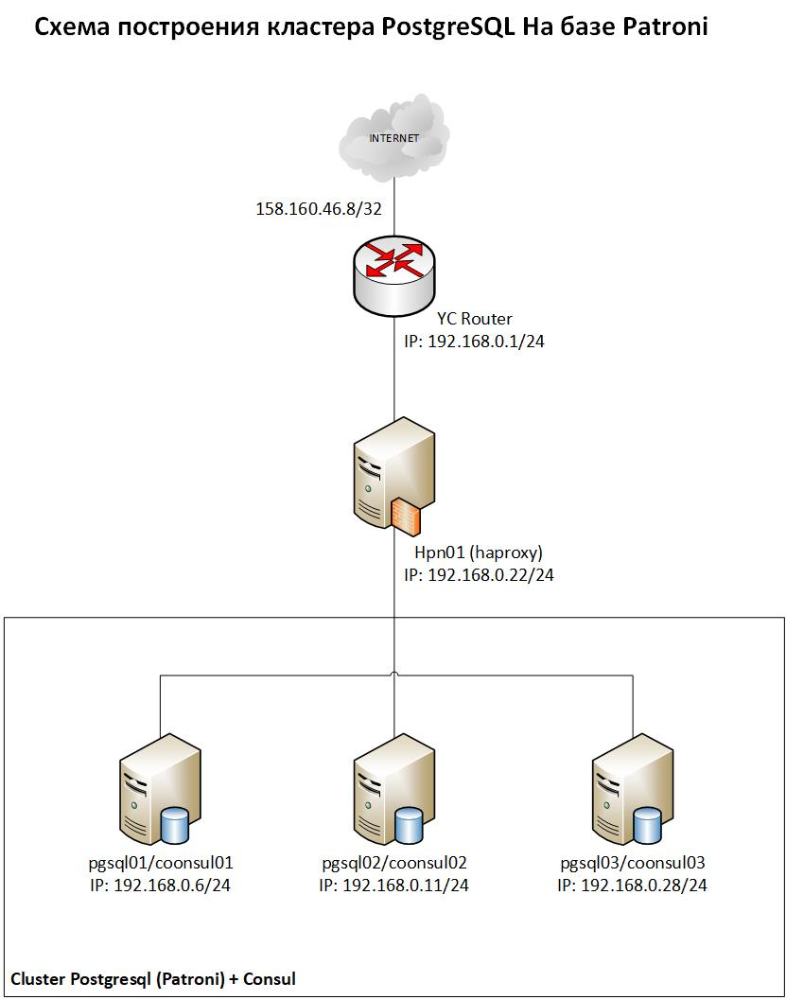

# Тема «Cоздание и тестирование высоконагруженного отказоустойчивого кластера PostgreSQL на базе Patroni»
## Схема сети:

## Создаем сетевую инфраструктуру:
````shell
supervisor@LAPTOP:~$ yc vpc network create --name otus-net --description "otus-net"
id: enpmren6u9oe7acuac9v
folder_id: b1gtl3nfrisb20i58jtb
created_at: "2024-12-22T08:08:52Z"
name: otus-net
description: otus-net
default_security_group_id: enpsrv5qulvr9tcj400j

a_myskin@LAPTOP-DASh-F15:~$ yc vpc network list
+----------------------+----------+
|          ID          |   NAME   |
+----------------------+----------+
| enpmren6u9oe7acuac9v | otus-net |
+----------------------+----------+

````
* ### Создание подсети:
```shell
supervisor@LAPTOP:~$ yc vpc subnet create --name otus-subnet --range 192.168.0.0/24 --network-name otus-net --description "otus-subnet"
id: e9b2e8chn2srkmr8e2tq
folder_id: b1gtl3nfrisb20i58jtb
created_at: "2024-12-22T08:11:28Z"
name: otus-subnet
description: otus-subnet
network_id: enpmren6u9oe7acuac9v
zone_id: ru-central1-a
v4_cidr_blocks:
  - 192.168.0.0/24

supervisor@LAPTOP:~$ yc vpc subnet list
+----------------------+-------------+----------------------+----------------+---------------+------------------+
|          ID          |    NAME     |      NETWORK ID      | ROUTE TABLE ID |     ZONE      |      RANGE       |
+----------------------+-------------+----------------------+----------------+---------------+------------------+
| e9b2e8chn2srkmr8e2tq | otus-subnet | enpmren6u9oe7acuac9v |                | ru-central1-a | [192.168.0.0/24] |
+----------------------+-------------+----------------------+----------------+---------------+------------------+

```
* ### Настройка DNS зоны:
```shell
supervisor@LAPTOP:~$ yc dns zone create --name otus-dns --zone staging. --private-visibility network-ids="e9b2e8chn2srkmr8e2tq"
id: dns5epssmqvtite5tlvb
folder_id: b1gtl3nfrisb20i58jtb
created_at: "2024-12-22T08:14:50.828Z"
name: otus-dns
zone: staging.
private_visibility: {}

supervisor@LAPTOP:~$ yc dns zone list
+----------------------+----------+----------+------------+-------------+
|          ID          |   NAME   |   ZONE   | VISIBILITY | DESCRIPTION |
+----------------------+----------+----------+------------+-------------+
| dns5epssmqvtite5tlvb | otus-dns | staging. |            |             |
+----------------------+----------+----------+------------+-------------+

```
## Создадим SSH ключи:
```shell
supervisor@LAPTOP:~$ ssh-keygen -t rsa -b 2048
Generating public/private rsa key pair.
Enter file in which to save the key (/home/a_myskin/.ssh/id_rsa): yc_key
Enter passphrase (empty for no passphrase):
Enter same passphrase again:
Your identification has been saved in yc_key
Your public key has been saved in yc_key.pub
```

## Развернем 3 ВМ для PostgreSQL:
```shell
supervisor@LAPTOP:~$ for i in {1..3}; do yc compute instance create --name pgsql$i --hostname pgsql$i --cores 2 --memory 4 --create-boot-disk size=10G,type=network-hdd,image-folder-id=standard-images,image-family=ubuntu-2004-lts --network-interface subnet-name=otus-subnet,nat-ip-version=ipv4 --ssh-key ~/
.ssh/yc_key.pub & done;
...
[1]   Done  yc compute instance create --name pgsql$i --hostname pgsql$i --cores 2 --memory 4 --create-boot-disk size=10G,type=network-hdd,image-folder-id=standard-images,image-family=ubuntu-2004-lts --network-interface subnet-name=otus-subnet,nat-ip-version=ipv4 --ssh-key ~/.ssh/yc_key.pub
[2]-  Done  yc compute instance create --name pgsql$i --hostname pgsql$i --cores 2 --memory 4 --create-boot-disk size=10G,type=network-hdd,image-folder-id=standard-images,image-family=ubuntu-2004-lts --network-interface subnet-name=otus-subnet,nat-ip-version=ipv4 --ssh-key ~/.ssh/yc_key.pub
[3]+  Done  yc compute instance create --name pgsql$i --hostname pgsql$i --cores 2 --memory 4 --create-boot-disk size=10G,type=network-hdd,image-folder-id=standard-images,image-family=ubuntu-2004-lts --network-interface subnet-name=otus-subnet,nat-ip-version=ipv4 --ssh-key ~/.ssh/yc_key.pub

a_myskin@LAPTOP-DASh-F15:~$ yc compute instances list
+----------------------+--------+---------------+---------+---------------+--------------+
|          ID          |  NAME  |    ZONE ID    | STATUS  |  EXTERNAL IP  | INTERNAL IP  |
+----------------------+--------+---------------+---------+---------------+--------------+
| fhm7qul3v52bp3k6loc9 | pgsql3 | ru-central1-a | RUNNING | 51.250.13.152 | 192.168.0.28 |
| fhmg2q9speqs0d6jaa2k | pgsql1 | ru-central1-a | RUNNING | 51.250.92.84  | 192.168.0.6  |
| fhmu5e662752dee46e4n | pgsql2 | ru-central1-a | RUNNING | 51.250.76.168 | 192.168.0.11 |
+----------------------+--------+---------------+---------+---------------+--------------+

```
## Установка и настройка кластера ключей Consul:
* ### Установка CONSUL на все машины:
```shell
supervisor@LAPTOP:~$ for i in {1..3}; do vm_ip_address=$(yc compute instance show --name pgsql$i | grep -E ' +address' | tail -n 1 | awk '{print $2}') && ssh -o StrictHostKeyChecking=no -i ~/.ssh/yc_key yc-user@$vm_ip_address 'sudo apt install -y consul'& done;

root@pgsql1:~# consul version
Consul v1.14.3
Revision bd257019
Build Date 2022-12-13T17:13:55Z
Protocol 2 spoken by default, understands 2 to 3 (agent will automatically use protocol >2 when speaking to compatible agents)

root@pgsql2:~# consul version
Consul v1.14.3
Revision bd257019
Build Date 2022-12-13T17:13:55Z
Protocol 2 spoken by default, understands 2 to 3 (agent will automatically use protocol >2 when speaking to compatible agents)

root@pgsql3:~# consul version
Consul v1.14.3
Revision bd257019
Build Date 2022-12-13T17:13:55Z
Protocol 2 spoken by default, understands 2 to 3 (agent will automatically use protocol >2 when speaking to compatible agents)

```
* ### Сгенерируем ключ для консула на любой из нод кластера:
```shell
root@pgsql1:~# consul keygen
***********************

```
* ### Создаем учетную запись, от которой будет работать консул:
```shell
supervisor@LAPTOP:~$ for i in {1..3}; do vm_ip_address=$(yc compute instance show --name pgsql$i | grep -E ' +address' | tail -n 1 | awk '{print $2}') && ssh -o StrictHostKeyChecking=no -i ~/.ssh/yc_key yc-user@$vm_ip_address 'sudo useradd -r -consul' & done;

root@pgsql1:~# grep -rin consul /etc/passwd
30:consul:x:109:115::/var/lib/consul:/usr/sbin/nologin

root@pgsql2:~# grep -rin consul /etc/passwd
30:consul:x:109:115::/var/lib/consul:/usr/sbin/nologin

root@pgsql3:~# grep -rin consul /etc/passwd
30:consul:x:109:115::/var/lib/consul:/usr/sbin/nologin
```
* ### Выставим нужные права:
```shell
supervisor@LAPTOP:~$ for i in {1..3}; do vm_ip_address=$(yc compute instance show --name pgsql$i | grep -E ' +address' | tail -n 1 | awk '{print $2}') && ssh -o StrictHostKeyChecking=no -i ~/.ssh/yc_key yc-user@$vm_ip_address 'sudo chown -R consul:consul /var/lib/consul /etc/consul.d/* && sudo chmod 775 /var/lib/consul /etc/consul.d' & done;
```
>> Создаем учётку **consul**, которая будет системной. Права будут полные у владельца, остальные смогут читать данные.
* ### Создаем конфигурационный файл для консула:
```shell
supervisor@LAPTOP:~$ for i in {1..3}; do vm_ip_address=$(yc compute instance show --name pgsql$i | grep -E ' +address' | tail -n 1 | awk '{print $2}') && ssh -o StrictHostKeyChecking=no -i ~/.ssh/yc_key yc-user@$vm_ip_address 'cat > temp.cfg << EOF 
{
    "bind_addr": "0.0.0.0",
    "bootstrap_expect": 3,
    "client_addr": "0.0.0.0",
    "data_dir": "/var/lib/consul",
    "datacenter": "yc1a",
    "node_name": "$(hostname)",
    "enable_script_checks": true,
    "dns_config": {
        "enable_truncate": true,
        "only_passing": true
    },
    "enable_syslog": true,
    "encrypt": "***********************",
    "leave_on_terminate": true,
    "log_level": "INFO",
    "rejoin_after_leave": true,
    "retry_join": [
        "pgsql1",
        "pgsql2",
        "pgsql3"
    ],
    "server": true,
    "start_join": [
        "pgsql1",
        "pgsql2",
        "pgsql3"
    ],
   "ui_config": { "enabled": true },
    "acl": {
        "enabled": true,
        "default_policy": "deny",
        "enable_token_persistence": true
    }
}
EOF
cat temp.cfg | sudo tee -a /etc/consul.d/config.json
' & done;
````
>> Включение авторизации в consul:
````shell
...
"ui_config": { "enabled": true },
    "acl": {
        "enabled": true,
        "default_policy": "deny",
        "enable_token_persistence": true
    }
....
````
>> Получаем токен командой для входа на сайт:
```shell
root@pgsql1:~# consul acl bootstrap
```
>> Для работы из командной строки также необходимо авторизоваться. Для этого создаем переменную в системном окружении:
```shell
root@pgsql1:~# export CONSUL_HTTP_TOKEN=********-****-****-****-************
root@pgsql2:~# export CONSUL_HTTP_TOKEN=********-****-****-****-************
root@pgsql3:~# export CONSUL_HTTP_TOKEN=********-****-****-****-************
```
>> **Создать новый токен можно командой:**
>> consul acl token create -policy-name global-management

>> **Чтобы увидеть список токенов, вводим:**
>> consul acl token list

>> **Если нам понадобиться удалить токен, мы должны использовать его AccessorID:**
>> consul acl token delete -id <**AccessorID**>

* ### Проверим конфиг на серверах:
>> pgsql1:
```shell
root@pgsql1:~# cat /etc/consul.d/config.json
{
    "bind_addr": "0.0.0.0",
    "bootstrap_expect": 3,
    "client_addr": "0.0.0.0",
    "data_dir": "/var/lib/consul",
    "enable_script_checks": true,
    "dns_config": {
        "enable_truncate": true,
        "only_passing": true
    },
    "enable_syslog": true,
    "encrypt": "***********************",
    "leave_on_terminate": true,
    "log_level": "INFO",
    "rejoin_after_leave": true,
    "retry_join": [
        "pgsql1",
        "pgsql2",
        "pgsql3"
    ],
    "server": true,
    "start_join": [
        "pgsql1",
        "pgsql2",
        "pgsql3"
    ],
   "ui_config": { "enabled": true }
}
```
>> pgsql2:
```shell
oot@pgsql2:~# cat /etc/consul.d/config.json
{
    "bind_addr": "0.0.0.0",
    "bootstrap_expect": 3,
    "client_addr": "0.0.0.0",
    "data_dir": "/var/lib/consul",
    "enable_script_checks": true,
    "dns_config": {
        "enable_truncate": true,
        "only_passing": true
    },
    "enable_syslog": true,
    "encrypt": "***********************",
    "leave_on_terminate": true,
    "log_level": "INFO",
    "rejoin_after_leave": true,
    "retry_join": [
        "pgsql1",
        "pgsql2",
        "pgsql3"
    ],
    "server": true,
    "start_join": [
        "pgsql1",
        "pgsql2",
        "pgsql3"
    ],
   "ui_config": { "enabled": true }
}
```
>> pgsql3:
```shell
root@pgsql3:~# cat /etc/consul.d/config.json
{
    "bind_addr": "0.0.0.0",
    "bootstrap_expect": 3,
    "client_addr": "0.0.0.0",
    "data_dir": "/var/lib/consul",
    "enable_script_checks": true,
    "dns_config": {
        "enable_truncate": true,
        "only_passing": true
    },
    "enable_syslog": true,
    "encrypt": "J***********************",
    "leave_on_terminate": true,
    "log_level": "INFO",
    "rejoin_after_leave": true,
    "retry_join": [
        "pgsql1",
        "pgsql2",
        "pgsql3"
    ],
    "server": true,
    "start_join": [
        "pgsql1",
        "pgsql2",
        "pgsql3"
    ],
   "ui_config": { "enabled": true }
}
```

* ### Проверяем корректность конфигурационного файла:
```shell
root@pgsql1:~# consul validate /etc/consul.d
Configuration is valid!

root@pgsql2:~# consul validate /etc/consul.d
Configuration is valid!

root@pgsql3:~# consul validate /etc/consul.d
Configuration is valid!
```
* ### Запускаем consul на каждой ноде:
```shell
supervisor@LAPTOP:~$ for i in {1..3}; do vm_ip_address=$(yc compute instance show --name pgsql$i | grep -E ' +address' | tail -n 1 | awk '{print $2}') && ssh -o StrictHostKeyChecking=no -i ~/.ssh/yc_key yc-user@$vm_ip_address 'sudo systemctl start consul && sudo systemctl enable consul' & done;
[1] 2497
[2] 2498
[3] 2499
a_myskin@LAPTOP:~$ Synchronizing state of consul.service with SysV service script with /lib/systemd/systemd-sysv-install.
Executing: /lib/systemd/systemd-sysv-install enable consul
Created symlink /etc/systemd/system/multi-user.target.wants/consul.service → /lib/systemd/system/consul.service.
Synchronizing state of consul.service with SysV service script with /lib/systemd/systemd-sysv-install.
Executing: /lib/systemd/systemd-sysv-install enable consul
Synchronizing state of consul.service with SysV service script with /lib/systemd/systemd-sysv-install.
Executing: /lib/systemd/systemd-sysv-install enable consul
Created symlink /etc/systemd/system/multi-user.target.wants/consul.service → /lib/systemd/system/consul.service.
Created symlink /etc/systemd/system/multi-user.target.wants/consul.service → /lib/systemd/system/consul.service.

[1]   Done vm_ip_address=$(yc compute instance show --name pgsql$i | grep -E ' +address' | tail -n 1 | awk '{print $2}') && ssh -o StrictHostKeyChecking=no -i ~/.ssh/yc_key yc-user@$vm_ip_address 'sudo systemctl start consul && sudo systemctl enable consul'
[2]-  Done vm_ip_address=$(yc compute instance show --name pgsql$i | grep -E ' +address' | tail -n 1 | awk '{print $2}') && ssh -o StrictHostKeyChecking=no -i ~/.ssh/yc_key yc-user@$vm_ip_address 'sudo systemctl start consul && sudo systemctl enable consul'
[3]+  Done vm_ip_address=$(yc compute instance show --name pgsql$i | grep -E ' +address' | tail -n 1 | awk '{print $2}') && ssh -o StrictHostKeyChecking=no -i ~/.ssh/yc_key yc-user@$vm_ip_address 'sudo systemctl start consul && sudo systemctl enable consul'
```
* ### Смотрим текущее состояние работы сервиса:
```shell
supervisor@LAPTOP:~$ for i in {1..3}; do vm_ip_address=$(yc compute instance show --name pgsql$i | grep -E ' +address' | tail -n 1 | awk '{print $2}') && ssh -o StrictHostKeyChecking=no -i ~/.ssh/yc_key yc-user@$vm_ip_address 'hostname; sudo systemctl status consul' & done;
[1] 2574
[2] 2575
[3] 2577
pgsql1
● consul.service - Consul agent
     Loaded: loaded (/lib/systemd/system/consul.service; enabled; vendor preset: enabled)
     Active: active (running) since Sun 2024-12-22 20:11:08 UTC; 7min ago
       Docs: https://www.consul.io/docs/
   Main PID: 5543 (consul)
      Tasks: 10 (limit: 4630)
     Memory: 13.5M
     CGroup: /system.slice/consul.service
             └─5543 /usr/bin/consul agent -data-dir=/var/lib/consul -config-dir=/etc/consul.d

Dec 22 20:11:08 pgsql1 consul[5543]:     2024/12/22 20:11:08 [INFO] serf: EventMemberJoin: consul3 192.168.0.28
Dec 22 20:11:08 pgsql1 consul[5543]: serf: EventMemberJoin: consul3 192.168.0.28
Dec 22 20:11:08 pgsql1 consul[5543]:     2024/12/22 20:11:08 [INFO] consul: Adding LAN server consul3 (Addr: tcp/192.168.0.28:8300) (DC: yc1a)
Dec 22 20:11:08 pgsql1 consul[5543]: consul: Adding LAN server consul3 (Addr: tcp/192.168.0.28:8300) (DC: yc1a)
Dec 22 20:11:13 pgsql1 consul[5543]:     2024/12/22 20:11:13 [WARN]  raft: Failed to get previous log: 84 log not found (last: 82)
Dec 22 20:11:13 pgsql1 consul[5543]:  raft: Failed to get previous log: 84 log not found (last: 82)
Dec 22 20:11:13 pgsql1 consul[5543]:     2024/12/22 20:11:13 [INFO] consul: New leader elected: consul2
Dec 22 20:11:13 pgsql1 consul[5543]: consul: New leader elected: consul2
Dec 22 20:11:13 pgsql1 consul[5543]:     2024/12/22 20:11:13 [INFO] agent: Synced node info
Dec 22 20:11:13 pgsql1 consul[5543]: agent: Synced node info
pgsql3
● consul.service - Consul agent
     Loaded: loaded (/lib/systemd/system/consul.service; enabled; vendor preset: enabled)
     Active: active (running) since Sun 2024-12-22 20:11:08 UTC; 7min ago
       Docs: https://www.consul.io/docs/
   Main PID: 5703 (consul)
      Tasks: 10 (limit: 4630)
     Memory: 13.1M
     CGroup: /system.slice/consul.service
             └─5703 /usr/bin/consul agent -data-dir=/var/lib/consul -config-dir=/etc/consul.d

Dec 22 20:11:08 pgsql3 consul[5703]: agent: started state syncer
Dec 22 20:11:08 pgsql3 consul[5703]: ==> Consul agent running!
Dec 22 20:11:09 pgsql3 consul[5703]:     2024/12/22 20:11:09 [INFO] agent: (LAN) joined: 4
Dec 22 20:11:09 pgsql3 consul[5703]: agent: (LAN) joined: 4
Dec 22 20:11:09 pgsql3 consul[5703]:     2024/12/22 20:11:09 [INFO] agent: Join LAN completed. Synced with 4 initial agents
Dec 22 20:11:09 pgsql3 consul[5703]: agent: Join LAN completed. Synced with 4 initial agents
Dec 22 20:11:13 pgsql3 consul[5703]:     2024/12/22 20:11:13 [INFO] agent: Synced node info
Dec 22 20:11:13 pgsql3 consul[5703]: agent: Synced node info
Dec 22 20:11:13 pgsql3 consul[5703]:     2024/12/22 20:11:13 [INFO] consul: New leader elected: consul2
Dec 22 20:11:13 pgsql3 consul[5703]: consul: New leader elected: consul2
pgsql2
● consul.service - Consul agent
     Loaded: loaded (/lib/systemd/system/consul.service; enabled; vendor preset: enabled)
     Active: active (running) since Sun 2024-12-22 20:11:06 UTC; 7min ago
       Docs: https://www.consul.io/docs/
   Main PID: 5905 (consul)
      Tasks: 11 (limit: 4630)
     Memory: 13.5M
     CGroup: /system.slice/consul.service
             └─5905 /usr/bin/consul agent -data-dir=/var/lib/consul -config-dir=/etc/consul.d

Dec 22 20:11:13 pgsql2 consul[5905]:     2024/12/22 20:11:13 [INFO]  raft: pipelining replication to peer {Voter d3d4cb99-30ab-4829-7292-878c293de69b 192.168.0.28:8300}
Dec 22 20:11:13 pgsql2 consul[5905]:  raft: pipelining replication to peer {Voter d3d4cb99-30ab-4829-7292-878c293de69b 192.168.0.28:8300}
Dec 22 20:11:13 pgsql2 consul[5905]:     2024/12/22 20:11:13 [WARN]  raft: AppendEntries to {Voter 09b63b01-1e4a-3ba2-b3d4-b78635e4d479 192.168.0.6:8300} rejected, sending older logs (next: 83)
Dec 22 20:11:13 pgsql2 consul[5905]:  raft: AppendEntries to {Voter 09b63b01-1e4a-3ba2-b3d4-b78635e4d479 192.168.0.6:8300} rejected, sending older logs (next: 83)
Dec 22 20:11:13 pgsql2 consul[5905]:     2024/12/22 20:11:13 [INFO]  raft: pipelining replication to peer {Voter 09b63b01-1e4a-3ba2-b3d4-b78635e4d479 192.168.0.6:8300}
Dec 22 20:11:13 pgsql2 consul[5905]:  raft: pipelining replication to peer {Voter 09b63b01-1e4a-3ba2-b3d4-b78635e4d479 192.168.0.6:8300}
Dec 22 20:11:13 pgsql2 consul[5905]:     2024/12/22 20:11:13 [INFO] consul: member 'consul1' joined, marking health alive
Dec 22 20:11:13 pgsql2 consul[5905]: consul: member 'consul1' joined, marking health alive
Dec 22 20:11:13 pgsql2 consul[5905]:     2024/12/22 20:11:13 [INFO] agent: Synced node info
Dec 22 20:11:13 pgsql2 consul[5905]: agent: Synced node info

[1]   Done                    vm_ip_address=$(yc compute instance show --name pgsql$i | grep -E ' +address' | tail -n 1 | awk '{print $2}') && ssh -o StrictHostKeyChecking=no -i ~/.ssh/yc_key yc-user@$vm_ip_address 'hostname; sudo systemctl status consul'
[2]-  Done                    vm_ip_address=$(yc compute instance show --name pgsql$i | grep -E ' +address' | tail -n 1 | awk '{print $2}') && ssh -o StrictHostKeyChecking=no -i ~/.ssh/yc_key yc-user@$vm_ip_address 'hostname; sudo systemctl status consul'
[3]+  Done                    vm_ip_address=$(yc compute instance show --name pgsql$i | grep -E ' +address' | tail -n 1 | awk '{print $2}') && ssh -o StrictHostKeyChecking=no -i ~/.ssh/yc_key yc-user@$vm_ip_address 'hostname; sudo systemctl status consul'
```
* ### Посмотрим состояние нод кластера:
```shell
supervisor@LAPTOP:~$ for i in {1..3}; do vm_ip_address=$(yc compute instance show --name pgsql$i | grep -E ' +address' | tail -n 1 | awk '{print $2}') && ssh -o StrictHostKeyChecking=no -i ~/.ssh/yc_key yc-user@$vm_ip_address 'sudo consul members' & done;
[1] 2689
[2] 2690
[3] 2691

Node     Address            Status  Type    Build  Protocol  DC   Segment
consul1  192.168.0.6:8301   alive   server  1.14.3  2       yc1a  <all>
consul2  192.168.0.11:8301  alive   server  1.14.3  2       yc1a  <all>
consul3  192.168.0.28:8301  alive   server  1.14.3  2       yc1a  <all>

Node     Address            Status  Type    Build  Protocol  DC   Segment
consul1  192.168.0.6:8301   alive   server  1.14.3  2       yc1a  <all>
consul2  192.168.0.11:8301  alive   server  1.14.3  2       yc1a  <all>
consul3  192.168.0.28:8301  alive   server  1.14.3  2       yc1a  <all>

Node     Address            Status  Type    Build  Protocol  DC   Segment
consul1  192.168.0.6:8301   alive   server  1.14.3  2       yc1a  <all>
consul2  192.168.0.11:8301  alive   server  1.14.3  2       yc1a  <all>
consul3  192.168.0.28:8301  alive   server  1.14.3  2       yc1a  <all>

[1]   Done vm_ip_address=$(yc compute instance show --name pgsql$i | grep -E ' +address' | tail -n 1 | awk '{print $2}') && ssh -o StrictHostKeyChecking=no -i ~/.ssh/yc_key yc-user@$vm_ip_address 'sudo consul members'
[2]-  Done vm_ip_address=$(yc compute instance show --name pgsql$i | grep -E ' +address' | tail -n 1 | awk '{print $2}') && ssh -o StrictHostKeyChecking=no -i ~/.ssh/yc_key yc-user@$vm_ip_address 'sudo consul members'
[3]+  Done vm_ip_address=$(yc compute instance show --name pgsql$i | grep -E ' +address' | tail -n 1 | awk '{print $2}') && ssh -o StrictHostKeyChecking=no -i ~/.ssh/yc_key yc-user@$vm_ip_address 'sudo consul members'
```
* ### Сайт CONSUL доступен по ссылке <http://158.160.46.8/ui/yc1a/services>

## Настройка кластера PostgreSQL на базе Patroni
* ### Установка PostgreSQL на 3 ВМ и сразу проверим:
```shell
supervisor@LAPTOP:~$ for i in {1..3}; do vm_ip_address=$(yc compute instance show --name pgsql$i | grep -E ' +address' | tail -n 1 | awk '{print $2}') && ssh -o StrictHostKeyChecking=no -i ~/.ssh/yc_key yc-user@$vm_ip_address 'sudo apt update && sudo apt upgrade -y -q && echo "deb http://apt.postgresql.org/pub/repos/apt $(lsb_release -cs)-pgdg main" | sudo tee -a /etc/apt/sources.list.d/pgdg.list && wget --quiet -O - https://www.postgresql.org/media/keys/ACCC4CF8.asc | sudo apt-key add - && sudo apt-get update && sudo apt -y install postgresql-14' & done;
supervisor@LAPTOP:~$ for i in {1..3}; do vm_ip_address=$(yc compute instance show --name pgsql$i | grep -E ' +address' | tail -n 1 | awk '{print $2}') && ssh -o StrictHostKeyChecking=no -i ~/.ssh/yc_key yc-user@$vm_ip_address 'hostname; pg_lsclusters' & done;
[1] 3366
[2] 3367
[3] 3369

pgsql1
Ver Cluster Port Status Owner    Data directory              Log file
14  main    5432 online postgres /var/lib/postgresql/14/main /var/log/postgresql/postgresql-14-main.log

pgsql3
Ver Cluster Port Status Owner    Data directory              Log file
14  main    5432 online postgres /var/lib/postgresql/14/main /var/log/postgresql/postgresql-14-main.log

pgsql2
Ver Cluster Port Status Owner    Data directory              Log file
14  main    5432 online postgres /var/lib/postgresql/14/main /var/log/postgresql/postgresql-14-main.log

[1]   Done vm_ip_address=$(yc compute instance show --name pgsql$i | grep -E ' +address' | tail -n 1 | awk '{print $2}') && ssh -o StrictHostKeyChecking=no -i ~/.ssh/yc_key yc-user@$vm_ip_address 'hostname; pg_lsclusters'
[2]-  Done vm_ip_address=$(yc compute instance show --name pgsql$i | grep -E ' +address' | tail -n 1 | awk '{print $2}') && ssh -o StrictHostKeyChecking=no -i ~/.ssh/yc_key yc-user@$vm_ip_address 'hostname; pg_lsclusters'
[3]+  Done vm_ip_address=$(yc compute instance show --name pgsql$i | grep -E ' +address' | tail -n 1 | awk '{print $2}') && ssh -o StrictHostKeyChecking=no -i ~/.ssh/yc_key yc-user@$vm_ip_address 'hostname; pg_lsclusters'```
```
* ### Установка Patroni:
```shell
supervisor@LAPTOP:~$ for i in {1..3}; do vm_ip_address=$(yc compute instance show --name pgsql$i | grep -E ' +address' | tail -n 1 | awk '{print $2}') && ssh -o StrictHostKeyChecking=no -i ~/.ssh/yc_key yc-user@$vm_ip_address 'sudo apt install -y python3 python3-pip git mc && sudo pip3 install psycopg2-binary && sudo systemctl stop postgresql@14-main && sudo -u postgres pg_dropcluster 14 main && sudo pip3 install patroni[consul] && sudo ln -s /usr/local/bin/patroni /bin/patroni' & done;
```
* ### Cоздадим юнит в systemd для возможности автоматического запуска сервиса Patroni:
```shell
supervisor@LAPTOP:~$ for i in {1..3}; do vm_ip_address=$(yc compute instance show --name pgsql$i | grep -E ' +address' | tail -n 1 | awk '{print $2}') && ssh -o StrictHostKeyChecking=no -i ~/.ssh/yc_key yc-user@$vm_ip_address 'cat > temp.cfg << EOF 
[Unit]
Description=High availability PostgreSQL Cluster
After=syslog.target network.target
[Service]
Type=simple
User=postgres
Group=postgres
ExecStart=/usr/local/bin/patroni /etc/patroni.yml
KillMode=process
TimeoutSec=30
Restart=no
[Install]
WantedBy=multi-user.target
EOF
cat temp.cfg | sudo tee -a /etc/systemd/system/patroni.service
' & done;
```
* ### Создадим конфиг Patroni:
```shell
supervisor@LAPTOP:~$ for i in {1..3}; do vm_ip_address=$(yc compute instance show --name pgsql$i | grep -E ' +address' | tail -n 1 | awk '{print $2}') && ssh -o StrictHostKeyChecking=no -i ~/.ssh/yc_key yc-user@$vm_ip_address 'cat > temp2.cfg << EOF 
scope: patroni
name: $(hostname)
restapi:
  listen: $(hostname -I | tr -d " "):8008
  connect_address: $(hostname -I | tr -d " "):8008
consul:
  host: "localhost:8500"
  register_service: true
  token: <consul-acl-token>
bootstrap:
  dcs:
    ttl: 30
    loop_wait: 10
    retry_timeout: 10
    maximum_lag_on_failover: 1048576
    postgresql:
      use_pg_rewind: true
      parameters:
  initdb: 
  - encoding: UTF8
  - data-checksums
  pg_hba: 
  - host replication replicator 10.0.0.0/24 md5
  - host all all 10.0.0.0/24 md5
  users:
    admin:
      password: admin_321
      options:
        - createrole
        - createdb
postgresql:
  listen: 127.0.0.1, $(hostname -I | tr -d " "):5432
  connect_address: $(hostname -I | tr -d " "):5432
  data_dir: /var/lib/postgresql/14/main
  bin_dir: /usr/lib/postgresql/14/bin
  pgpass: /tmp/pgpass0
  authentication:
    replication:
      username: replicator
      password: <password>
    superuser:
      username: postgres
      password: <password>
    rewind:  
      username: rewind_user
      password: <password>
  parameters:
    unix_socket_directories: '.'
tags:
    nofailover: false
    noloadbalance: false
    clonefrom: false
    nosync: false
EOF
cat temp2.cfg | sudo tee -a /etc/patroni.yml
' & done;
```

* ### Проверим конфиги на серверах:
>> pgsql1
```shell
root@pgsql1:~# cat /etc/patroni.yml
scope: patroni
name: pgsql1
restapi:
  listen: 192.168.0.6:8008
  connect_address: 192.168.0.6:8008
consul:
  host: "localhost:8500"
  register_service: true
  token: <consul-acl-token>
bootstrap:
  dcs:
    ttl: 30
    loop_wait: 10
    retry_timeout: 10
    maximum_lag_on_failover: 1048576
    postgresql:
      use_pg_rewind: true
      parameters:
  initdb:
  - encoding: UTF8
  - data-checksums
  pg_hba:
  - host replication replicator 192.168.0.0/24 md5
  - host all all 192.168.0.0/24 md5
  users:
    admin:
      password: admin_321
      options:
        - createrole
        - createdb
postgresql:
  listen: 127.0.0.1, 192.168.0.6:5432
  connect_address: 192.168.0.6:5432
  data_dir: /var/lib/postgresql/14/main
  bin_dir: /usr/lib/postgresql/14/bin
  pgpass: /tmp/pgpass0
  authentication:
    replication:
      username: replicator
      password: **********
    superuser:
      username: postgres
      password: **********
    rewind:
      username: rewind_user
      password: **********
  parameters:
    unix_socket_directories: .
tags:
    nofailover: false
    noloadbalance: false
    clonefrom: false
    nosync: false
```
>> pgsql2
```shell
root@pgsql2:~# cat /etc/patroni.yml
scope: patroni
name: pgsql2
restapi:
  listen: 192.168.0.11:8008
  connect_address: 192.168.0.11:8008
consul:
  host: "localhost:8500"
  register_service: true
  token: <consul-acl-token>
bootstrap:
  dcs:
    ttl: 30
    loop_wait: 10
    retry_timeout: 10
    maximum_lag_on_failover: 1048576
    postgresql:
      use_pg_rewind: true
      parameters:
  initdb:
  - encoding: UTF8
  - data-checksums
  pg_hba:
  - host replication replicator 192.168.0.0/24 md5
  - host all all 192.168.0.0/24 md5
  users:
    admin:
      password: admin_321
      options:
        - createrole
        - createdb
postgresql:
  listen: 127.0.0.1, 192.168.0.11:5432
  connect_address: 192.168.0.11:5432
  data_dir: /var/lib/postgresql/14/main
  bin_dir: /usr/lib/postgresql/14/bin
  pgpass: /tmp/pgpass0
  authentication:
    replication:
      username: replicator
      password: **********
    superuser:
      username: postgres
      password: **********
    rewind:
      username: rewind_user
      password: **********
  parameters:
    unix_socket_directories: .
tags:
    nofailover: false
    noloadbalance: false
    clonefrom: false
    nosync: false
```
>>pgsql3
```shell
root@pgsql3:~# cat /etc/patroni.yml
scope: patroni
name: pgsql3
restapi:
  listen: 192.168.0.28:8008
  connect_address: 192.168.0.28:8008
consul:
  host: "localhost:8500"
  register_service: true
  token: <consul-acl-token>
bootstrap:
  dcs:
    ttl: 30
    loop_wait: 10
    retry_timeout: 10
    maximum_lag_on_failover: 1048576
    postgresql:
      use_pg_rewind: true
      parameters:
  initdb:
  - encoding: UTF8
  - data-checksums
  pg_hba:
  - host replication replicator 192.168.0.0/24 md5
  - host all all 192.168.0.0/24 md5
  users:
    admin:
      password: admin_321
      options:
        - createrole
        - createdb
postgresql:
  listen: 127.0.0.1, 192.168.0.28:5432
  connect_address: 192.168.0.28:5432
  data_dir: /var/lib/postgresql/14/main
  bin_dir: /usr/lib/postgresql/14/bin
  pgpass: /tmp/pgpass0
  authentication:
    replication:
      username: replicator
      password: **********
    superuser:
      username: postgres
      password: **********
    rewind:
      username: rewind_user
      password: **********
  parameters:
    unix_socket_directories: .
tags:
    nofailover: false
    noloadbalance: false
    clonefrom: false
    nosync: false
```
* ### Запускаем Patroni:
```shell
supervisor@LAPTOP:~$ for i in {1..3}; do vm_ip_address=$(yc compute instance show --name pgsql$i | grep -E ' +address' | tail -n 1 | awk '{print $2}') && ssh -o StrictHostKeyChecking=no -i ~/.ssh/yc_key yc-user@$vm_ip_address 'sudo systemctl enable patroni && sudo systemctl start patroni && sudo patronictl -c /etc/patroni.yml list' & done;
[1] 3881
[2] 3882
[3] 3884
a_myskin@LAPTOP-DASh-F15:~$ Created symlink /etc/systemd/system/multi-user.target.wants/patroni.service → /etc/systemd/system/patroni.service.
Created symlink /etc/systemd/system/multi-user.target.wants/patroni.service → /etc/systemd/system/patroni.service.
Created symlink /etc/systemd/system/multi-user.target.wants/patroni.service → /etc/systemd/system/patroni.service.
+ Cluster: patroni (uninitialized) -+-----------+
| Member | Host | Role | State | TL | Lag in MB |
+--------+------+------+-------+----+-----------+
+--------+------+------+-------+----+-----------+
+ Cluster: patroni (uninitialized) -+-----------+
| Member | Host | Role | State | TL | Lag in MB |
+--------+------+------+-------+----+-----------+
+--------+------+------+-------+----+-----------+
+ Cluster: patroni (uninitialized) -+-----------+
| Member | Host | Role | State | TL | Lag in MB |
+--------+------+------+-------+----+-----------+
+--------+------+------+-------+----+-----------+

[1]   Done vm_ip_address=$(yc compute instance show --name pgsql$i | grep -E ' +address' | tail -n 1 | awk '{print $2}') && ssh -o StrictHostKeyChecking=no -i ~/.ssh/yc_key yc-user@$vm_ip_address 'sudo systemctl enable patroni && sudo systemctl start patroni && sudo patronictl -c /etc/patroni.yml list'
[2]-  Done vm_ip_address=$(yc compute instance show --name pgsql$i | grep -E ' +address' | tail -n 1 | awk '{print $2}') && ssh -o StrictHostKeyChecking=no -i ~/.ssh/yc_key yc-user@$vm_ip_address 'sudo systemctl enable patroni && sudo systemctl start patroni && sudo patronictl -c /etc/patroni.yml list'
[3]+  Done vm_ip_address=$(yc compute instance show --name pgsql$i | grep -E ' +address' | tail -n 1 | awk '{print $2}') && ssh -o StrictHostKeyChecking=no -i ~/.ssh/yc_key yc-user@$vm_ip_address 'sudo systemctl enable patroni && sudo systemctl start patroni && sudo patronictl -c /etc/patroni.yml list'

```
* ### Проверим кластер:
```shell
supervisor@LAPTOP:~$ for i in {1..3}; do vm_ip_address=$(yc compute instance show --name pgsql$i | grep -E ' +address' | tail -n 1 | awk '{print $2}') && ssh -o StrictHostKeyChecking=no -i ~/.ssh/yc_key yc-user@$vm_ip_address 'sudo patronictl -c /etc/patroni.yml list' & done;
[1] 3951
[2] 3952
[3] 3953
+ Cluster: patroni (7451367085296931935) -----+----+-----------+
| Member | Host         | Role    | State     | TL | Lag in MB |
+--------+--------------+---------+-----------+----+-----------+
| pgsql1 | 192.168.0.6  | Replica | streaming |  1 |         0 |
| pgsql2 | 192.168.0.11 | Replica | streaming |  1 |         0 |
| pgsql3 | 192.168.0.28 | Leader  | running   |  1 |           |
+--------+--------------+---------+-----------+----+-----------+
+ Cluster: patroni (7451367085296931935) -----+----+-----------+
| Member | Host         | Role    | State     | TL | Lag in MB |
+--------+--------------+---------+-----------+----+-----------+
| pgsql1 | 192.168.0.6  | Replica | streaming |  1 |         0 |
| pgsql2 | 192.168.0.11 | Replica | streaming |  1 |         0 |
| pgsql3 | 192.168.0.28 | Leader  | running   |  1 |           |
+--------+--------------+---------+-----------+----+-----------+
+ Cluster: patroni (7451367085296931935) -----+----+-----------+
| Member | Host         | Role    | State     | TL | Lag in MB |
+--------+--------------+---------+-----------+----+-----------+
| pgsql1 | 192.168.0.6  | Replica | streaming |  1 |         0 |
| pgsql2 | 192.168.0.11 | Replica | streaming |  1 |         0 |
| pgsql3 | 192.168.0.28 | Leader  | running   |  1 |           |
+--------+--------------+---------+-----------+----+-----------+

[1]   Done vm_ip_address=$(yc compute instance show --name pgsql$i | grep -E ' +address' | tail -n 1 | awk '{print $2}') && ssh -o StrictHostKeyChecking=no -i ~/.ssh/yc_key yc-user@$vm_ip_address 'sudo patronictl -c /etc/patroni.yml list'
[2]-  Done vm_ip_address=$(yc compute instance show --name pgsql$i | grep -E ' +address' | tail -n 1 | awk '{print $2}') && ssh -o StrictHostKeyChecking=no -i ~/.ssh/yc_key yc-user@$vm_ip_address 'sudo patronictl -c /etc/patroni.yml list'
[3]+  Done vm_ip_address=$(yc compute instance show --name pgsql$i | grep -E ' +address' | tail -n 1 | awk '{print $2}') && ssh -o StrictHostKeyChecking=no -i ~/.ssh/yc_key yc-user@$vm_ip_address 'sudo patronictl -c /etc/patroni.yml list'
```
## Установка и конфигурация Haproxy
* ### Установка
```shell
a_myskin@LAPTOP-DASh-F15:~$ yc compute instance create --name hpr01 --hostname hpr01 --cores 2 --memory 4 --create-boot-disk size=10G,type=network-hdd,image
-folder-id=standard-images,image-family=ubuntu-2204-lts --network-interface subnet-name=otus-subnet,nat-ip-version=ipv4 --ssh-key ~/.ssh/yc_key.pub
done (48s)
```
>> зайдём на сервер по ssh и продолжим установку там: 
```shell
yc-user@hpr01:~$ sudo apt install -y haproxy
```
* ### Создадим конфиг для Haproxy:
```shell
root@hpr01:~# cat /etc/haproxy/haproxy.cfg
global
        log /dev/log    local0
        log /dev/log    local1 notice
        chroot /var/lib/haproxy
        stats socket /run/haproxy/admin.sock mode 660 level admin expose-fd listeners
        stats timeout 30s
        user haproxy
        group haproxy
        daemon

        # Default SSL material locations
        ca-base /etc/ssl/certs
        crt-base /etc/ssl/private

        # See: https://ssl-config.mozilla.org/#server=haproxy&server-version=2.0.3&config=intermediate
        ssl-default-bind-ciphers ECDHE-ECDSA-AES128-GCM-SHA256:ECDHE-RSA-AES128-GCM-SHA256:ECDHE-ECDSA-AES256-GCM-SHA384:ECDHE-RSA-AES256-GCM-SHA384:ECDHE-ECDSA-CHACHA20-POLY1305:ECDHE-RSA-CHACHA20-POLY1305:DHE-RSA-AES128-GCM-SHA256:DHE-RSA-AES256-GCM-SHA384
        ssl-default-bind-ciphersuites TLS_AES_128_GCM_SHA256:TLS_AES_256_GCM_SHA384:TLS_CHACHA20_POLY1305_SHA256
        ssl-default-bind-options ssl-min-ver TLSv1.2 no-tls-tickets

defaults
        log     global
        mode    http
        option  httplog
        option  dontlognull
        timeout connect 5000
        timeout client  50000
        timeout server  50000
        errorfile 400 /etc/haproxy/errors/400.http
        errorfile 403 /etc/haproxy/errors/403.http
        errorfile 408 /etc/haproxy/errors/408.http
        errorfile 500 /etc/haproxy/errors/500.http
        errorfile 502 /etc/haproxy/errors/502.http
        errorfile 503 /etc/haproxy/errors/503.http
        errorfile 504 /etc/haproxy/errors/504.http

frontend consul
        bind 0.0.0.0:80
        mode http
        default_backend consulweb

listen postgres_write
        bind 0.0.0.0:5432
        mode tcp
        option tcplog
        option httpchk
        http-check connect
        http-check send meth GET uri /master
        http-check expect status 200
        default-server inter 1s fall 3 on-marked-down shutdown-sessions on-marked-up shutdown-backup-sessions
        server pgsql01 192.168.0.6:5432 check port 8008
        server pgsql02 192.168.0.11:5432 check port 8008
        server pgsql03 192.168.0.28:5432 check port 8008

listen postgres_read
        bind 0.0.0.0:5433
        mode tcp
        option tcplog
        option httpchk
        http-check send meth GET uri /replica
        http-check expect status 200
        default-server inter 1s fall 3 on-marked-down shutdown-sessions on-marked-up shutdown-backup-sessions
        server pgsql01 192.168.0.6:5432 check port 8008
        server pgsql02 192.168.0.11:5432 check port 8008
        server pgsql03 192.168.0.28:5432 check port 8008

backend consulweb
        mode http
        option httpchk
        option  forwardfor
        balance roundrobin
        server consul01 192.168.0.6:8500 check
        server consul02 192.168.0.11:8500 check
        server consul03 192.168.0.28:8500 check
```
* ### Запуск:
```shell
root@hpr01:~# systemctl enable haproxy
Synchronizing state of haproxy.service with SysV service script with /lib/systemd/systemd-sysv-install.
Executing: /lib/systemd/systemd-sysv-install enable haproxy
root@hpr01:~# systemctl start haproxy
root@hpr01:~# systemctl status haproxy
● haproxy.service - HAProxy Load Balancer
     Loaded: loaded (/lib/systemd/system/haproxy.service; enabled; vendor preset: enabled)
     Active: active (running) since Tue 2024-12-22 03:39:56 UTC; 55min ago
       Docs: man:haproxy(1)
             file:/usr/share/doc/haproxy/configuration.txt.gz
   Main PID: 2517 (haproxy)
      Tasks: 3 (limit: 4564)
     Memory: 69.3M
        CPU: 134ms
     CGroup: /system.slice/haproxy.service
             ├─2517 /usr/sbin/haproxy -Ws -f /etc/haproxy/haproxy.cfg -p /run/haproxy.pid -S /run/haproxy-master.sock
             └─2520 /usr/sbin/haproxy -Ws -f /etc/haproxy/haproxy.cfg -p /run/haproxy.pid -S /run/haproxy-master.sock
```
# Тестирование кластера
>> Проверим состояние кластера и вручную переключим 
```shell
root@pgsql1:~# patronictl -c /etc/patroni.yml switchover
Current cluster topology
+ Cluster: patroni (7451367085296931935) -----+----+-----------+
| Member | Host         | Role    | State     | TL | Lag in MB |
+--------+--------------+---------+-----------+----+-----------+
| pgsql1 | 192.168.0.6  | Replica | streaming |  1 |         0 |
| pgsql2 | 192.168.0.11 | Replica | streaming |  1 |         0 |
| pgsql3 | 192.168.0.28 | Leader  | running   |  1 |           |
+--------+--------------+---------+-----------+----+-----------+
Primary [pgsql3]:
Candidate ['pgsql1', 'pgsql2'] []:
When should the switchover take place (e.g. 2024-12-24T11:20 )  [now]:
Are you sure you want to switchover cluster patroni, demoting current leader pgsql3? [y/N]: y
2024-12-24 10:21:14.39661 Successfully switched over to "pgsql1"
+ Cluster: patroni (7451367085296931935) ---+----+-----------+
| Member | Host         | Role    | State   | TL | Lag in MB |
+--------+--------------+---------+---------+----+-----------+
| pgsql1 | 192.168.0.6  | Leader  | running |  1 |           |
| pgsql2 | 192.168.0.11 | Replica | running |  1 |         0 |
| pgsql3 | 192.168.0.28 | Replica | stopped |    |   unknown |
+--------+--------------+---------+---------+----+-----------+
root@pgsql1:~# patronictl -c /etc/patroni.yml list
+ Cluster: patroni (7451367085296931935) -----+----+-----------+
| Member | Host         | Role    | State     | TL | Lag in MB |
+--------+--------------+---------+-----------+----+-----------+
| pgsql1 | 192.168.0.6  | Leader  | running   |  2 |           |
| pgsql2 | 192.168.0.11 | Replica | streaming |  2 |         0 |
| pgsql3 | 192.168.0.28 | Replica | streaming |  2 |         0 |
+--------+--------------+---------+-----------+----+-----------+

```
>> Остоновим одну ноду pgsql01 (Master) кластера:
```shell
root@pgsql3:~# patronictl -c /etc/patroni.yml list
+ Cluster: patroni (7451367085296931935) -----+----+-----------+
| Member | Host         | Role    | State     | TL | Lag in MB |
+--------+--------------+---------+-----------+----+-----------+
| pgsql2 | 192.168.0.11 | Leader  | running   |  3 |           |
| pgsql3 | 192.168.0.28 | Replica | streaming |  3 |         0 |
+--------+--------------+---------+-----------+----+-----------+
```
>> Запустим обратно ноду pgsql01 кластера и проверим:
```shell
root@pgsql3:~# patronictl -c /etc/patroni.yml list
+ Cluster: patroni (7451367085296931935) -----+----+-----------+
| Member | Host         | Role    | State     | TL | Lag in MB |
+--------+--------------+---------+-----------+----+-----------+
| pgsql1 | 192.168.0.6  | Replica | streaming |  3 |         0 |
| pgsql2 | 192.168.0.11 | Leader  | running   |  3 |           |
| pgsql3 | 192.168.0.28 | Replica | streaming |  3 |         0 |
+--------+--------------+---------+-----------+----+-----------+
```
>> Создадим БД на ноде pgsql2 (Master):
```shell
yc-user@pgsql2:~$ psql -h 127.0.0.1 -U postgres
psql (14.15 (Ubuntu 14.15-1.pgdg20.04+1))
Type "help" for help.

postgres=# \l
                                  List of databases
   Name    |  Owner   | Encoding |   Collate   |    Ctype    |   Access privileges
-----------+----------+----------+-------------+-------------+-----------------------
 postgres  | postgres | UTF8     | en_US.UTF-8 | en_US.UTF-8 |
 template0 | postgres | UTF8     | en_US.UTF-8 | en_US.UTF-8 | =c/postgres          +
           |          |          |             |             | postgres=CTc/postgres
 template1 | postgres | UTF8     | en_US.UTF-8 | en_US.UTF-8 | =c/postgres          +
           |          |          |             |             | postgres=CTc/postgres
 test      | postgres | UTF8     | en_US.UTF-8 | en_US.UTF-8 |
(4 rows)

postgres=# CREATE DATABASE testdb;
CREATE DATABASE
postgres=# \l
                                  List of databases
   Name    |  Owner   | Encoding |   Collate   |    Ctype    |   Access privileges
-----------+----------+----------+-------------+-------------+-----------------------
 postgres  | postgres | UTF8     | en_US.UTF-8 | en_US.UTF-8 |
 template0 | postgres | UTF8     | en_US.UTF-8 | en_US.UTF-8 | =c/postgres          +
           |          |          |             |             | postgres=CTc/postgres
 template1 | postgres | UTF8     | en_US.UTF-8 | en_US.UTF-8 | =c/postgres          +
           |          |          |             |             | postgres=CTc/postgres
 test      | postgres | UTF8     | en_US.UTF-8 | en_US.UTF-8 |
 testdb    | postgres | UTF8     | en_US.UTF-8 | en_US.UTF-8 |
(5 rows)
```
>> На pgsql1 (Replica):
```shell
root@pgsql1:~# psql -h 127.0.0.1 -U postgres
psql (14.15 (Ubuntu 14.15-1.pgdg20.04+1))
Type "help" for help.

postgres=# \l
                                  List of databases
   Name    |  Owner   | Encoding |   Collate   |    Ctype    |   Access privileges
-----------+----------+----------+-------------+-------------+-----------------------
 postgres  | postgres | UTF8     | en_US.UTF-8 | en_US.UTF-8 |
 template0 | postgres | UTF8     | en_US.UTF-8 | en_US.UTF-8 | =c/postgres          +
           |          |          |             |             | postgres=CTc/postgres
 template1 | postgres | UTF8     | en_US.UTF-8 | en_US.UTF-8 | =c/postgres          +
           |          |          |             |             | postgres=CTc/postgres
 test      | postgres | UTF8     | en_US.UTF-8 | en_US.UTF-8 |
 testdb    | postgres | UTF8     | en_US.UTF-8 | en_US.UTF-8 |
(5 rows)
```
>> На pgsql3 (Replica):
```shell
root@pgsql3:~# psql -h 127.0.0.1 -U postgres
psql (14.15 (Ubuntu 14.15-1.pgdg20.04+1))
Type "help" for help.

postgres=# \l
                                  List of databases
   Name    |  Owner   | Encoding |   Collate   |    Ctype    |   Access privileges
-----------+----------+----------+-------------+-------------+-----------------------
 postgres  | postgres | UTF8     | en_US.UTF-8 | en_US.UTF-8 |
 template0 | postgres | UTF8     | en_US.UTF-8 | en_US.UTF-8 | =c/postgres          +
           |          |          |             |             | postgres=CTc/postgres
 template1 | postgres | UTF8     | en_US.UTF-8 | en_US.UTF-8 | =c/postgres          +
           |          |          |             |             | postgres=CTc/postgres
 test      | postgres | UTF8     | en_US.UTF-8 | en_US.UTF-8 |
 testdb    | postgres | UTF8     | en_US.UTF-8 | en_US.UTF-8 |
(5 rows)
```

